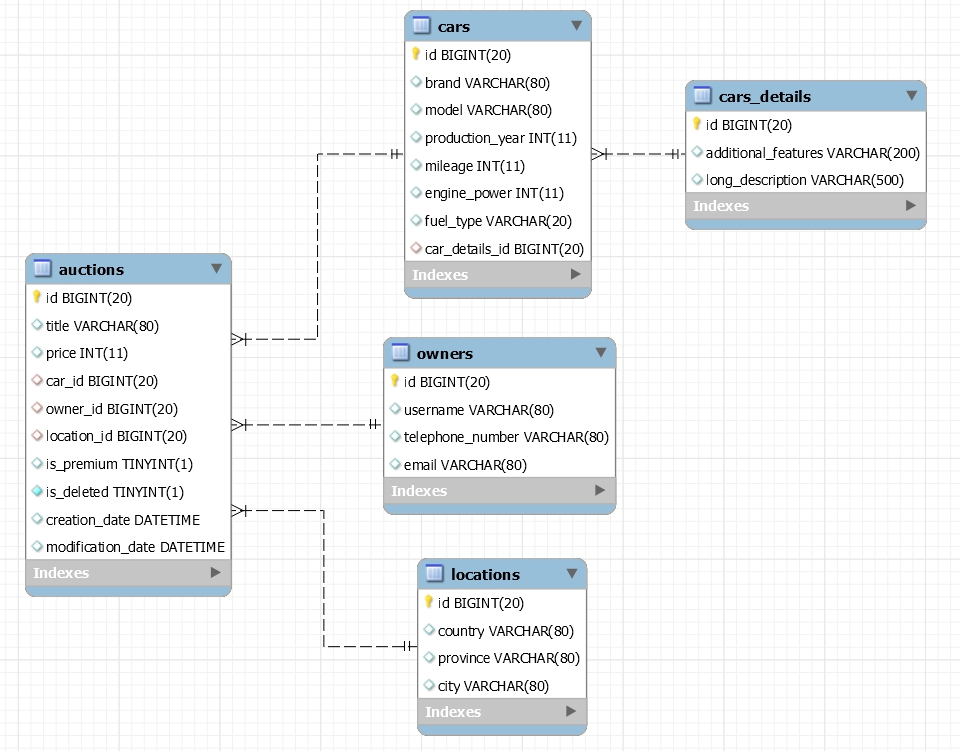

# SellYourCar
Web service based on REST architecture and CQRS pattern. It allows us to :

- create new auction
- update auction ( some fields are unchangeable )
- delete auction ( soft delete, remains in the database, but is not shown in the search results )
- upgrade auction to premium auction ( higher in the search results )
- retrieve auction ( contains all available fields to the user )
- retrieve all auctions ( contains only basic fields )
- retrieve page of auctions ( contains only basic fields )
- retrieve page of auctions by word ( Search for the auction page, which 
  contatins in the title/car brand/car model given the word )

## technology used :
 ### - Backend :
     - Spring Boot
     - Spring MVC
     - Spring Data JPA
     - JPA & Hibernate
     - Lombok
     
 ### - Tests : 
     - JUnit 5
     - Mockito 2
  
 ### - Databases : 
     - H2 [ embedded ]
     - MySQL
     - PostgreSQl
     
 ### - Documentation : 
     - Swagger2

## Database diagram :
  

## Launching instruction :

  1.  Download 
  2.  Unzip 
  3.  Go to "SQL" folder and select the appropriate database schema 
  4.  Create database with this schema 
  5.  Load data into the database from the Data folder 
  6.  If you are using PostgreSQL database in application.properties change active profile to 
      "postgresql", if you are using MySQL change to "mysql", if you are using H2 change to "h2"
  7.  In file application-mysql.properties, or application-postgresql.properties, or 
      application-h2.properties ( depending on th selected database ) enter correct database url,
      username and password ( for H2, you do not have to do it ). 
  8.  Run Application
  9.  Run Client ( e.g Postman ) 
  10. Enjoy the management of car auctions :)
  
